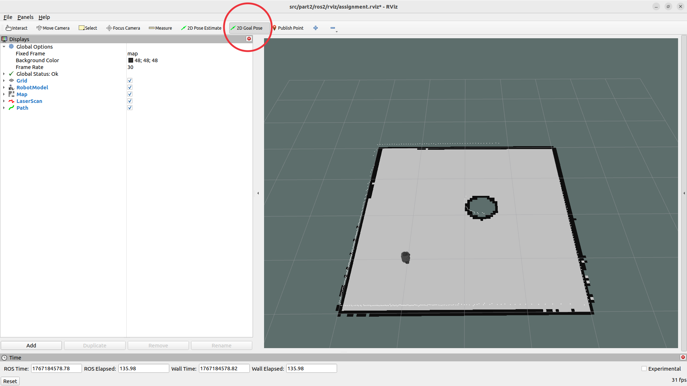

# Part 2: Navigation and Planning algorithms with Pre-built Map

This package implements Potential field and RRT (Rapidly-exploring Random Tree) path planning with pre-built map navigation using ROS 2 and Webots.

## Requirements

```bash
sudo apt install ros-jazzy-webots-ros2
sudo apt install ros-jazzy-turtlebot3-description
sudo apt install ros-jazzy-nav2-map-server ros-jazzy-nav2-lifecycle-manager
```

## Setup the repo
Open a terminal and create directory in Documents:
```bash
cd ~/Documents
mkdir -p course/robotics_ws/src
cd ~/Documents/course/robotics_ws/src
git clone https://github.com/MohismLab/undergraduate_robotics_assignment.git
```
or you can download the repository as zip file, and extrat the zip file  to obtain following files:
```bash
images/
src/
install_dependencies.sh
README.md
```

## Build

```bash
cd ~/Documents/course/robotics_ws
colcon build
source install/setup.bash
```

## Running Potential Filed Navigation

**Terminal 1: Start Webots simulator + fake_localization**
```bash
ros2 launch part2_ros2 webots_world.launch.py
```

**Terminal 2: Start map server (pre-built map)**
```bash
ros2 launch part2_ros2 potential_field_navigation.launch.py
```

## Running RRT Navigation

**Terminal 1: Start Webots simulator + fake_localization**
```bash
ros2 launch part2_ros2 webots_world.launch.py
```

**Terminal 2: Start map server (pre-built map)**
```bash
ros2 launch part2_ros2 map.launch.py
```

**Terminal 3: Start RRT navigation**
```bash
ros2 launch part2_ros2 rrt_navigation.launch.py
```

**Setting Navigation Goals**

- Open RViz2 and use the **"2D Goal Pose"** tool to set destinations

```bash
rviz2 -d rviz/assignment.rviz
```

- Or publish directly:
  ```bash
  ros2 topic pub /goal_pose geometry_msgs/PoseStamped "{header: {frame_id: 'map'}, pose: {position: {x: 1.0, y: 1.0}, orientation: {w: 1.0}}}"
  ```


## Architecture
```
TF Tree:
  map --(dynamic ajust)--> odom --(noisy)--> base_link

Topics:
  /robot_pose   - Ground truth pose from Webots (PoseStamped)
  /map          - Pre-built occupancy grid (384x384, 0.05m/pixel)
  /cmd_vel      - Velocity commands to robot
  /scan         - LiDAR scan data
  /goal_pose    - Navigation goal (from RViz2)
```
Using **fake localization** for accurate positioning:

### Key Nodes

| Node | Description |
|------|-------------|
| `fake_localization` | Computes dynamic `map -> odom` TF to compensate for odometry drift |
| `robot_pose_publisher` | Publishes ground truth `/robot_pose` from Webots |
| `rrt_navigation` | RRT path planning and trajectory following |
| `map_server` | Serves the pre-built map from `map.yaml` |

## Trouble Shooting


